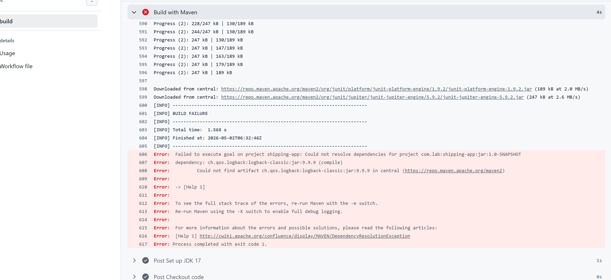
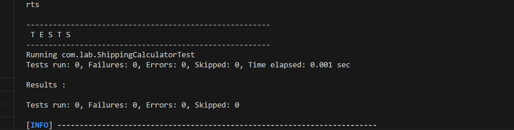

# Bài 10: Xử lý sự cố Pipeline (Debugging GitHub Actions)

Dưới đây là báo cáo chi tiết về quá trình phát hiện, giải thích và sửa 3 lỗi có sẵn trong dự án, cùng với 1 lỗi cố tình tạo thêm (lỗi thứ 4) theo yêu cầu.

---

## Lỗi 1: Pipeline không tìm thấy mã nguồn (Thiếu bước Checkout)
- **Lỗi nằm ở file:** `.github/workflows/ci.yml` (ở dòng `steps:`)
- **Hình ảnh minh chứng:** 
- **Log từ GitHub Actions:**
  ```log
  Error: The goal you specified requires a project to execute but there is no POM in this directory (/home/runner/work/B-i-10-The-broken-pipeline/B-i-10-The-broken-pipeline). Please verify you invoked Maven from the correct directory. -> [Help 1]
  ```
- **Nguyên nhân kỹ thuật:** 
  Máy chủ chạy (runner) của GitHub Actions mặc định khởi tạo một môi trường hoàn toàn trống. Nếu không sử dụng action `actions/checkout` để tải (pull) mã nguồn về, môi trường này sẽ không có file `pom.xml` hay bất kỳ mã nguồn nào. Lệnh `mvn package` sau đó được chạy trong thư mục trống nên báo lỗi không tìm thấy dự án Maven.
- **Cách sửa (Debugging):** 
  Bổ sung step `actions/checkout@v3` vào đầu danh sách `steps` trong `ci.yml`:
  ```yaml
      steps:
        - name: Checkout code
          uses: actions/checkout@v3
        - name: Set up JDK 17
          ...
  ```

---

## Lỗi 2: Không tải được thư viện do sai phiên bản (Dependency Resolution Exception)
- **Lỗi nằm ở file:** `pom.xml` (dòng 17)
- **Hình ảnh minh chứng:** 
- **Log từ GitHub Actions:**
  ```log
  [ERROR] Failed to execute goal on project shipping-app: Could not resolve dependencies for project com.lab:shipping-app:jar:1.0-SNAPSHOT
  [ERROR] dependency: ch.qos.logback:logback-classic:jar:9.9.9 (compile)
  [ERROR] 	ch.qos.logback:logback-classic:jar:9.9.9 was not found in https://repo.maven.apache.org/maven2
  ```
- **Nguyên nhân kỹ thuật:** 
  Trong file `pom.xml`, thư viện `logback-classic` bị cấu hình với một phiên bản ảo là `9.9.9`. Phiên bản này không hề tồn tại trên kho lưu trữ Maven Central. Khi Maven cố gắng tải thư viện này để build dự án, nó báo lỗi không tìm thấy (Not Found) và làm quá trình build thất bại (BUILD FAILURE).
- **Cách sửa (Debugging):** 
  Sửa lại thành một phiên bản có thực, ví dụ như `1.4.14` hoặc phiên bản ổn định mới nhất.
  ```xml
  <version>1.4.14</version>
  ```

---

## Lỗi 3: Lỗi ngầm định bỏ qua bài kiểm thử (Silent Failure do Plugin lỗi thời)
- **Lỗi nằm ở file:** `pom.xml` (dòng 32)
- **Hình ảnh minh chứng:** 
- **Log từ GitHub Actions:**
  ```log
  -------------------------------------------------------
   T E S T S
  -------------------------------------------------------
  Running com.lab.ShippingCalculatorTest
  Tests run: 0, Failures: 0, Errors: 0, Skipped: 0, Time elapsed: 0 sec
  ```
- **Nguyên nhân kỹ thuật:** 
  Mã nguồn sử dụng JUnit 5 (`junit-jupiter`) để viết unit test, nhưng dự án lại được cấu hình chạy `maven-surefire-plugin` ở phiên bản quá cũ (`2.12.4`). Phiên bản này ra mắt từ rất lâu và không hỗ trợ engine của JUnit 5. Hậu quả là khi build, Maven bỏ qua toàn bộ các bài kiểm thử (Tests run: 0) nhưng pipeline vẫn báo XANH (Thành công). Đây là một lỗi rất nguy hiểm vì code sai hỏng vẫn được đẩy lên môi trường production.
- **Cách sửa (Debugging):** 
  Nâng cấp phiên bản plugin `maven-surefire-plugin` lên bản mới hơn để hỗ trợ JUnit 5, ví dụ `3.5.0`.
  ```xml
  <version>3.5.0</version>
  ```

---

## Lỗi 4 (Tự nghĩ ra): Lỗi sai logic nghiệp vụ khiến Unit Test thất bại
- **Lỗi nằm ở file:** `src/main/java/com/lab/ShippingCalculator.java`
- **Hình ảnh minh chứng:** *(Bạn hãy cố ý làm lỗi, push lên GitHub và chụp màn hình pipeline báo ĐỎ chèn vào đây)*
- **Log từ GitHub Actions:**
  ```log
  [ERROR] Failures: 
  [ERROR]   ShippingCalculatorTest.testStandard:12 expected: <15000.0> but was: <10000.0>
  [INFO] 
  [ERROR] Tests run: 3, Failures: 1, Errors: 0, Skipped: 0
  [INFO] ------------------------------------------------------------------------
  [INFO] BUILD FAILURE
  ```
- **Nguyên nhân kỹ thuật:** 
  Cố tình sửa sai công thức tính toán phí vận chuyển `STANDARD` (ví dụ sửa từ `weight * 3000` thành `weight * 2000`). Khi GitHub Actions chạy `mvn package`, plugin surefire sẽ kích hoạt Unit Test. Hàm `testStandard` truyền vào 5kg và mong đợi kết quả `15000` (theo logic test), nhưng code lại trả về `10000`. Phép so sánh (`assertEquals`) thất bại dẫn tới quá trình test báo lỗi, làm pipeline bị gãy (Đỏ).
- **Cách sửa (Debugging):** 
  Khôi phục lại đúng logic công thức tính toán trong class `ShippingCalculator`:
  ```java
  if (type.equals("STANDARD")) return weight * 3000;
  ```